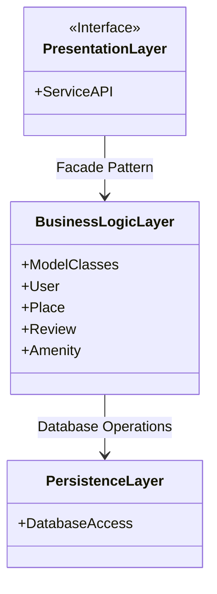
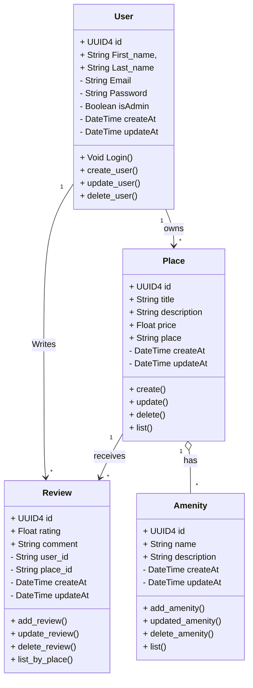
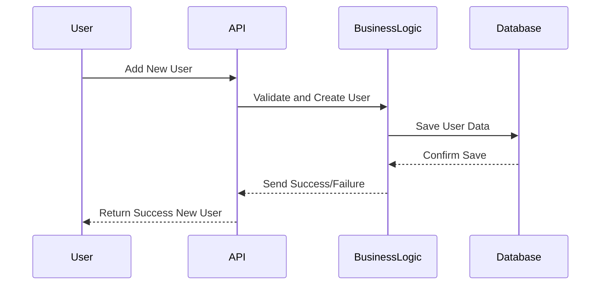
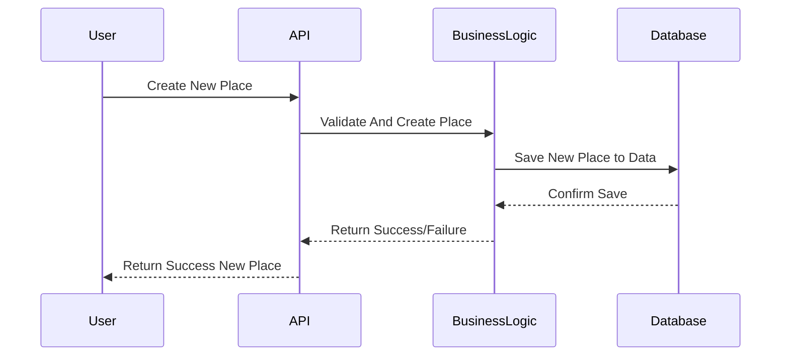
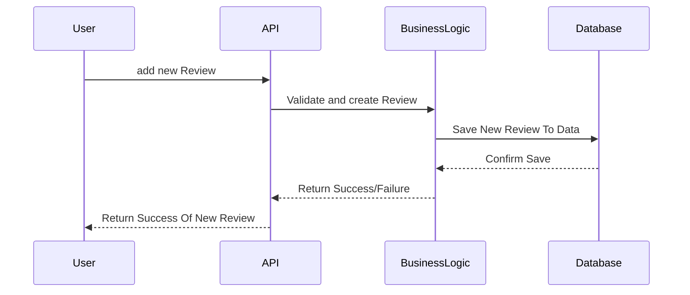
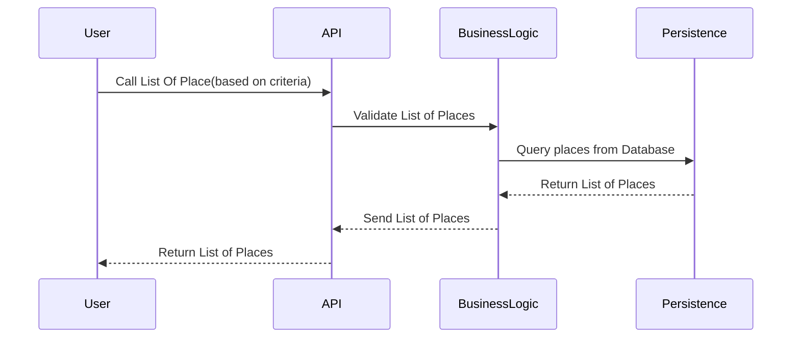

# HBNB Project Blueprint
## Introduction

**Welcome to the HBNB-UML project from Holberton School!** This project aims to create comprehensive technical documentation for the HBnB system, using UML diagrams to illustrate the system’s architecture and interactions. This document will guide the implementation phases, providing a clear reference for the design and development of the application.

## High-Level Architecture

### Explanation diagrams

`PresentationLayer:` Contains the ServiceAPI interface which exposes the application’s services between the user and the application.

`BusinessLogicLayer:` Contains the model classes (ModelClasses, User, Place, Review, Amenity) that handle the business logic.

`PersistenceLayer:` Contains DatabaseAccess for database operations

`Relationship Summary:`

The Facade Pattern interact with PresantationLayer and BusinessLogicLayer. The latter Performs database operations through the persistence layer.

## Business Logic Layer

### Explanation diagrams

#### Detailed Explanation of Entities and Their Relationships:

**_Public (+):_**

`id`, `firstName`, `lastName`: Basic information visible to other parts of the system.

**_Private (-):_**

`email`, `password`: Credentials needed for user authentication.

`isAdmin`: Indicates the role of the user (regular user or admin).

`createdAt`, `updatedAt`: Timestamps for tracking when a user account was created or modified.
Methods:

`login(email, password)`: Handles user authentication.

`createUser()`, `updateUser()`, `deleteUser()`: CRUD (Create, Read, Update, Delete) operations for user management.

`listUsers()`: Retrieves a list of all users (useful for admin purposes).

**_Business Logic:_**

The `User` entity is crucial in managing access control and authentication.
For example, `login()` ensures only authenticated users can perform certain actions like managing places or writing reviews. Additionally, the `isAdmin` flag differentiates between regular users and administrators, granting higher privileges to the latter.

**_Place:_**

`id`, `title`, `description`, `price`, `location`: Public attributes that describe a place and its characteristics.

## API Interaction Flow

### Diagrams

##### **1. User Registration API Call** #####

### Explanation of first diagrams

- The user sends a request to create an account via the API.
- The API forwards the request to the Business Logic to validate the data.
- If everything is correct, the Business Logic stores the data in the Database.
- The Database confirms that the data has been saved.
- The Business Logic informs the API of the success or failure.
- The API returns the final response to the user.

##### **2. Place Creation API Call** #####

### Explanation of second diagrams

- The user sends a request to create a new place via the API.
- The API sends the data to the Business Logic for validation and processing.
- The Business Logic stores the place in the database after validation.
- The database confirms that the data has been saved.
- The Business Logic informs the API of the success or failure.
- The API sends the final response to the user, indicating whether the place has been successfully created.

##### **3.Review Submission** #####

### Explanation of third diagrams

- The user submits a request to add a new review via the API.
- The API forwards the review data to the Business Logic for validation and processing.
- The Business Logic saves the validated review in the database.
- The database confirms that the review has been successfully saved.
- The Business Logic informs the API of the success or failure of the operation.
- The API sends the final response back to the user, confirming whether the new review was successfully added.

##### **4.Fetching a List of Places** #####

### Explanation of the last diagrams

- The user requests a list of places from the API based on specific criteria.
- The API validates the request criteria by forwarding them to the Business Logic.
- The Business Logic queries the Persistence layer for the relevant places in the database.
- The Persistence layer returns the list of matching places to the Business Logic.
- The Business Logic sends the formatted list of places back to the API.
- The API returns the final list of places to the user.

## Conclusion

The HBNB-UML project provides a clear framework for developing the HBnB system, utilizing UML diagrams to illustrate its architecture and processes.
It outlines essential API interactions for user registration, place creation, review submissions, and retrieving lists of places, ensuring efficient
communication between the Presentation Layer, Business Logic Layer, and Persistence Layer. This documentation serves as a solid foundation for
implementation, enhancing user experience and supporting future enhancements.
